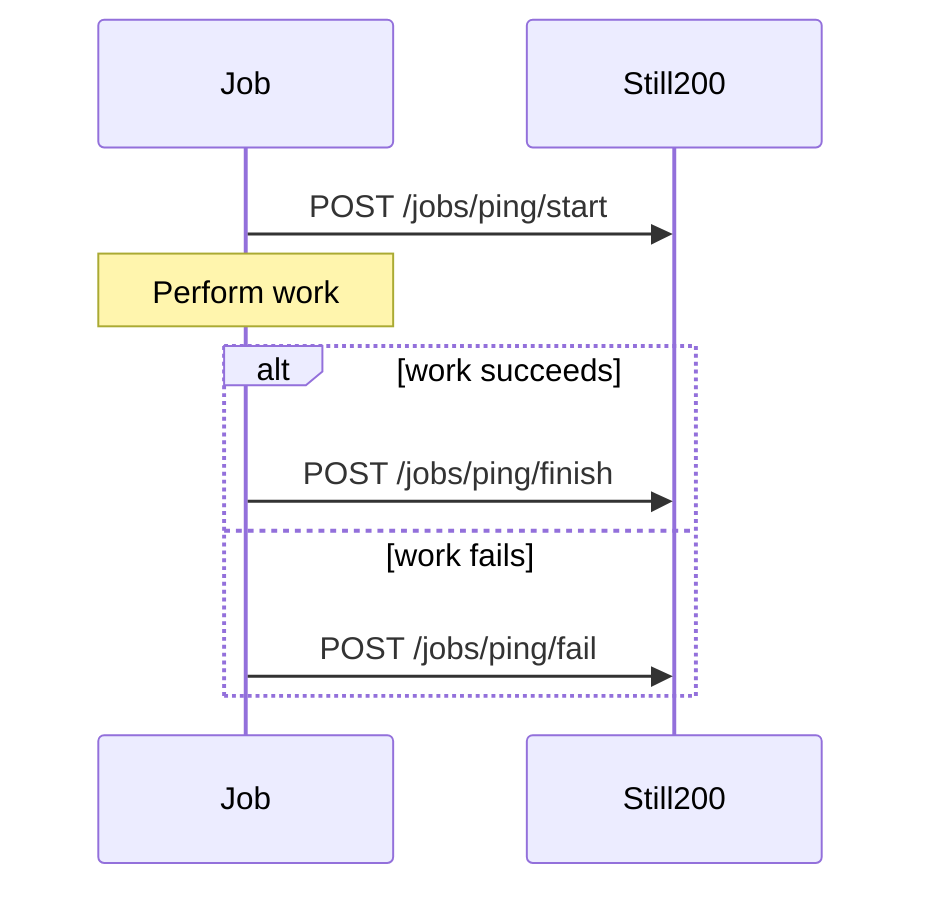

Scheduled-job monitoring reverses the HTTP-monitoring flow: your job reports its lifecycle to Still200. Still200 already knows when the job should run from its cron schedule, so a missing start ping becomes a missed run.

Still200 detects three failure modes:

- **Missed:** no start ping arrived by the scheduled time plus its grace period.
- **Failed:** the job called the fail endpoint.
- **Timed out:** the job started but sent no terminal ping before its configured maximum runtime.

<CardGroup cols={2}>
  <Card title="Configure a schedule" icon="calendar" href="/scheduled-jobs/configure" />
  <Card title="Report runs" icon="signal" href="/scheduled-jobs/report-runs" />
</CardGroup>
