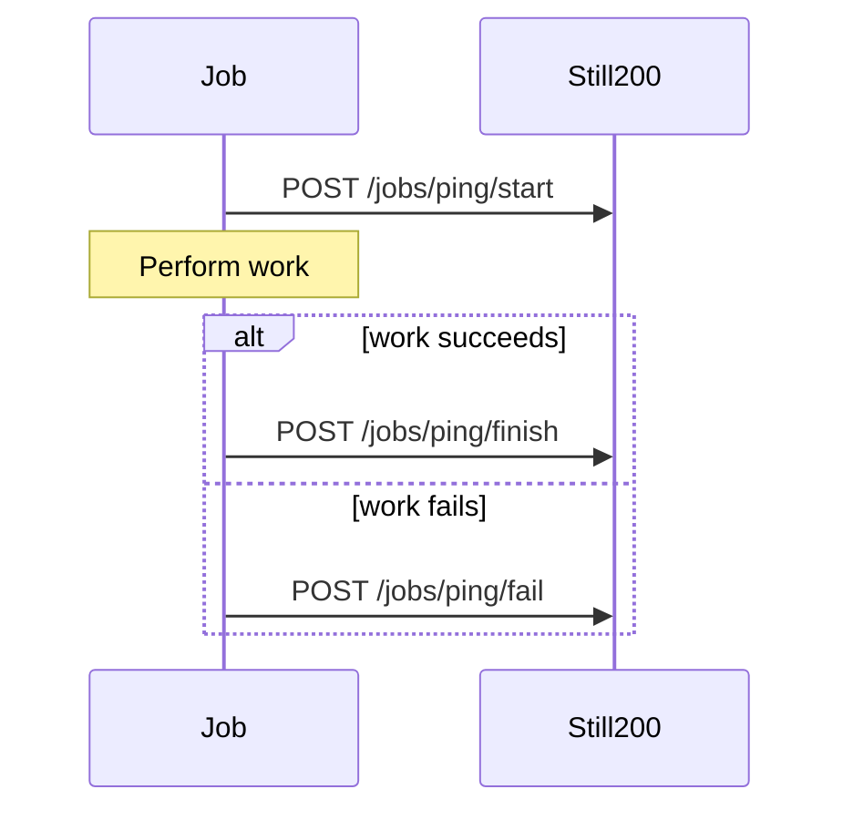

Scheduled-job monitoring reverses the HTTP-monitoring flow: your job reports its lifecycle to Still200. Still200 already knows when the job should run from its cron schedule, so a missing start ping becomes a missed run.

```mermaid
sequenceDiagram
    participant Job
    participant Still200
    Job->>Still200: POST /jobs/ping/start
    Note over Job: Perform work
    alt work succeeds
        Job->>Still200: POST /jobs/ping/finish
    else work fails
        Job->>Still200: POST /jobs/ping/fail
    end
```

Still200 detects three failure modes:

- **Missed:** no start ping arrived by the scheduled time plus its grace period.
- **Failed:** the job called the fail endpoint.
- **Timed out:** the job started but sent no terminal ping before its configured maximum runtime.

The same model works for AI agents that run on a schedule. Treat each scheduled invocation of the agent as one job run, and Still200 will catch an agent that never starts, errors out, or gets stuck looping past its maximum runtime. See the [AI agent loop example](/scheduled-jobs/examples#ai-agent-loops).

<CardGroup cols={2}>
  <Card title="Configure a schedule" icon="calendar" href="/scheduled-jobs/configure" />
  <Card title="Report runs" icon="signal" href="/scheduled-jobs/report-runs" />
</CardGroup>
