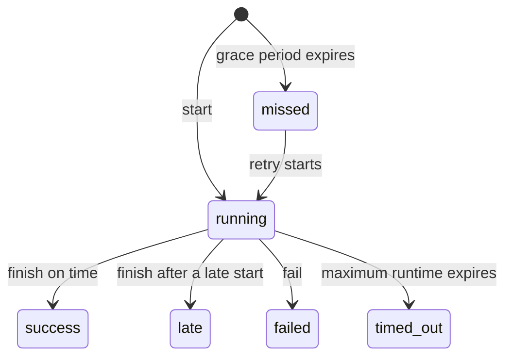

| Status | Meaning | Terminal |
| --- | --- | --- |
| `running` | Still200 received the start ping and is waiting for a terminal ping. | No |
| `success` | The run started within its grace window and finished successfully. | Yes |
| `late` | A missed or late run eventually started and finished successfully. | Yes |
| `missed` | No start ping arrived before the grace period ended. | Yes, unless the job later retries |
| `failed` | The job explicitly reported a failure. | Yes |
| `timed_out` | No terminal ping arrived before the maximum runtime elapsed. | Yes |

<Note>
  `late` means the job did run, so it counts as a successful execution while remaining visible as late in the run history.
</Note>
